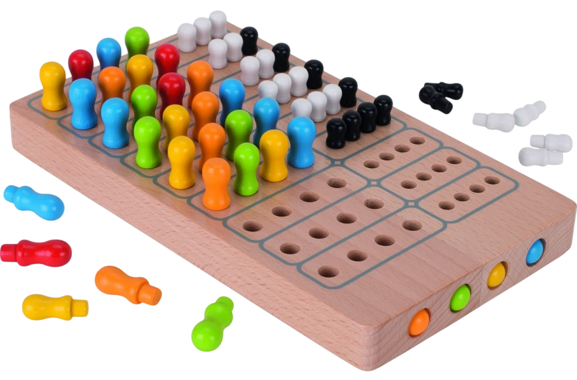

# Mastermind CLI (Swift)

A Swift command-line client for playing [Mastermind](https://en.wikipedia.org/wiki/Mastermind) using the public API at `https://mastermind.darkube.app`. 

<p align="center">  
    
</p>

Guess the 4-digit code and get feedback after each guess.

---

## Features

- Start a new game via API
- Submit guesses and receive feedback:
  - `B` = correct digit in the correct position
  - `W` = correct digit in the wrong position
- Exit the game at any time
- Automatically deletes the game on exit or when the code is guessed

---

## Requirements

- Swift 5.5+
- Internet connection
- macOS, Linux, or any environment supporting Swift CLI

---

## Installation

1. Clone the repository:

```bash
git clone https://github.com/foratik/Mastermind.git
cd Mastermind
```

Compile the Swift file:

```bash
swiftc Mastermind.swift -o Mastermind
```
Run the game:

```bash
./Mastermind
```

How to Play
1. Start the game by running the compiled executable.

2. Enter a 4-digit guess using digits 1-6.

3. Feedback will be given after each guess:

  - B = correct digit and correct position

  - W = correct digit but wrong position

4. Repeat until you guess all 4 digits correctly.

5. Type exit at any time to quit the game.

---

## API Endpoints Used
- `POST /game` – Create a new game

- `POST /guess` – Submit a guess

- `DELETE /game/{game_id}` – Delete a game
